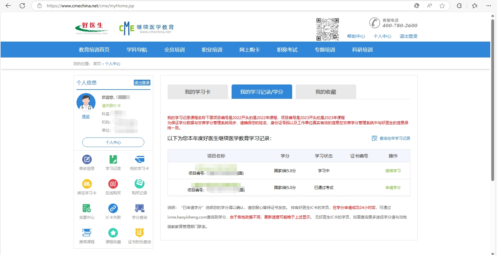
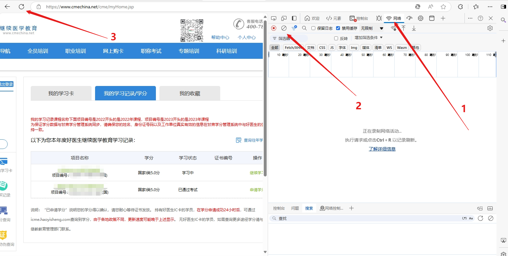
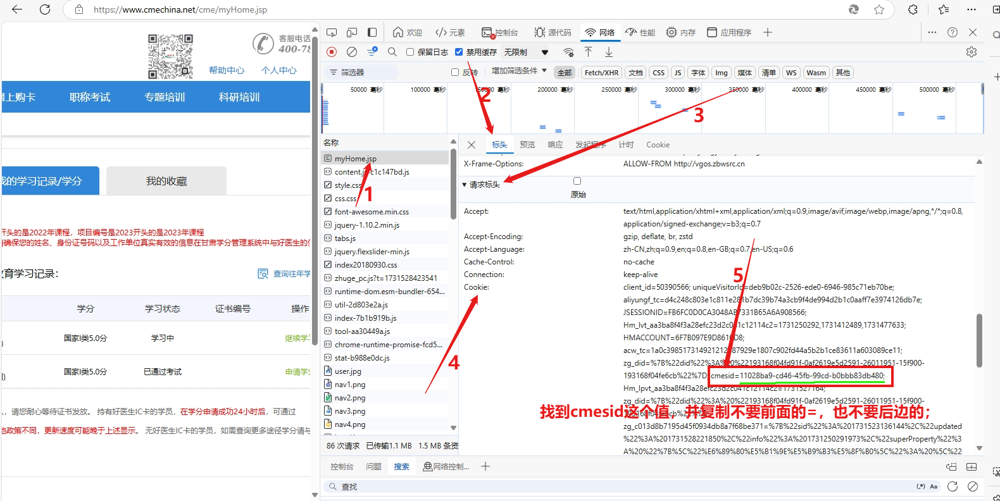
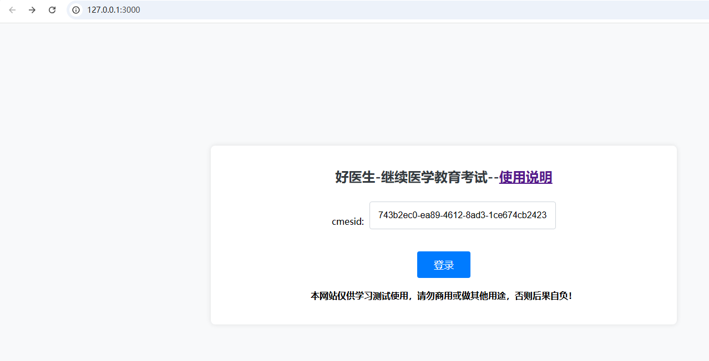
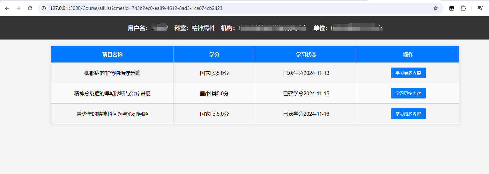
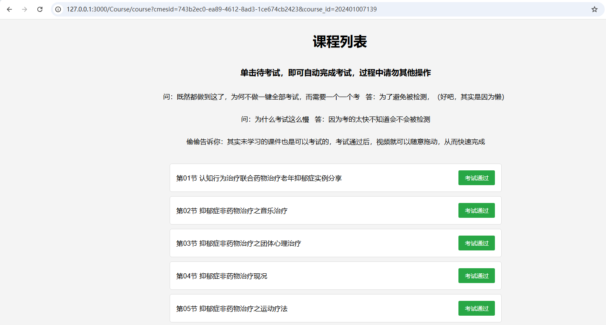
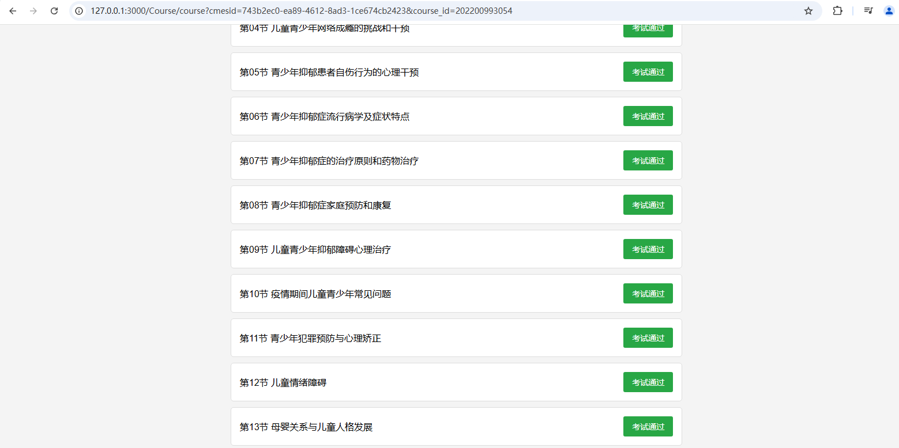

## 使用说明
#### 本网站仅供学习测试使用，请勿商用或做其他用途，否则后果自负！
#### 本网站不会收集您的任何信息
#### 添加请说明来意。

#### Gitee地址：[https://gitee.com/zpp800/haoyisheng](https://gitee.com/zpp800/haoyisheng)
### 此网页为[好医生-CME继续教育](https://www.cmechina.net/index.jsp)提供自动答题功能(未学习的也可以考试，这样视频进度条就可以任意拖动了)
- 第一步：你需要成功登录 好医生--继续医学教育（CME），并来到此界面

- 第二步：可以按快捷 F12 或者 ctrl+shift+i 打开开发者工具，
          或者点击浏览器右上角三个点----->更多工具----->开发者工具

- 刷新后即可看到，如图所示，找到myHome.jsp并单击

- 找到这个值并复制

- 将复制的值填入，单击登录
- 第三步：然后你就可以看到，当前学习的课程，待考试的课件

